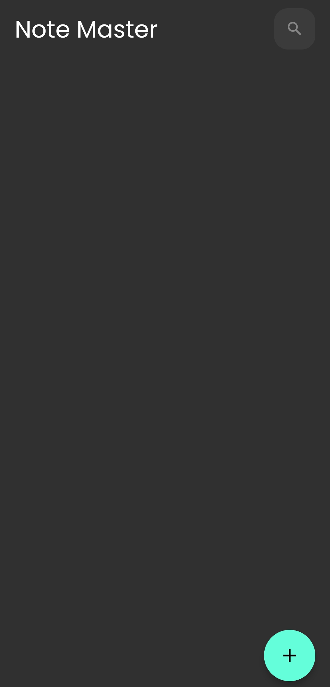
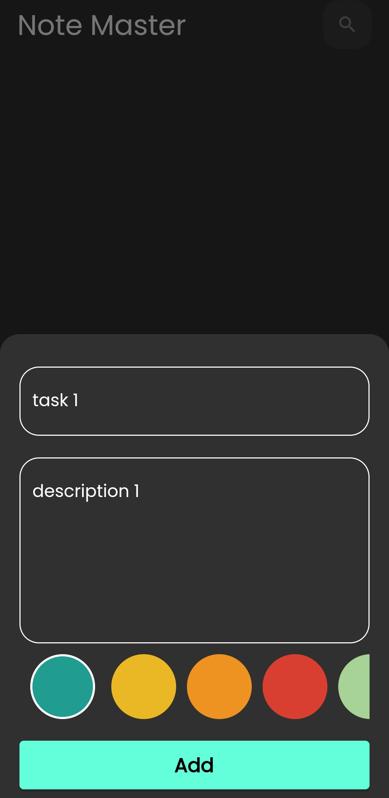
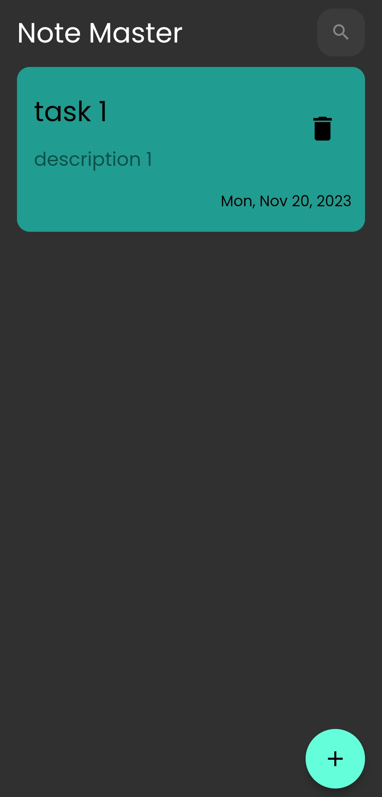
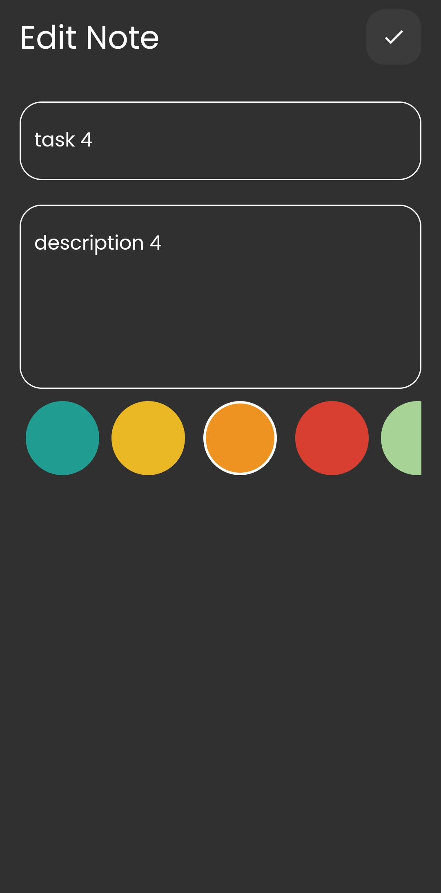
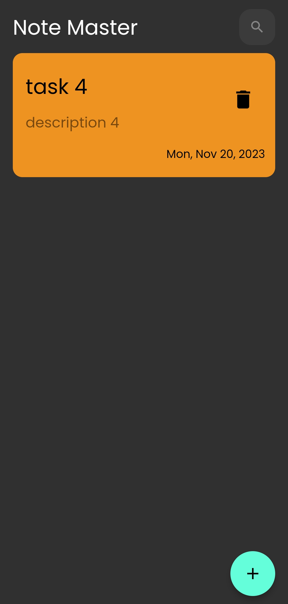

# NoteMaster

NoteMaster is a user-friendly and intuitive notes app that helps you streamline your note-taking process. Whether you're jotting down quick reminders, organizing your thoughts, or capturing important ideas

## Technology used:

- State management: Cubit
- local database : Hive

## packages used:

- flutter hive 
- google_fonts
- flutter_bloc
- modal_progress_hud_nsn

## ScreenShots

